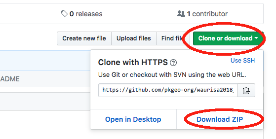

# waurisa2018_workshop_data #
Data Downloads needed for the Web Mapping with Vector Tiles Workshop at the WAURISA 2018 Conference

Please clone the repository to your local machine in preparation for the course.

If you are comfortable with git or github clone the repository in your usual fashion.

If you are unfamliar with git tools or github, the simplest method to download the data is to click on the green button above labeled _Clone or download_ and select the _Download ZIP_ option on the resulting dialog box.

Extract the files from the zip file. Generally this can be done by double clicking the zip file in the file management window. Be sure to note where you have unzipped the file. This will need to know the directory path to use the file in the class excercises.
